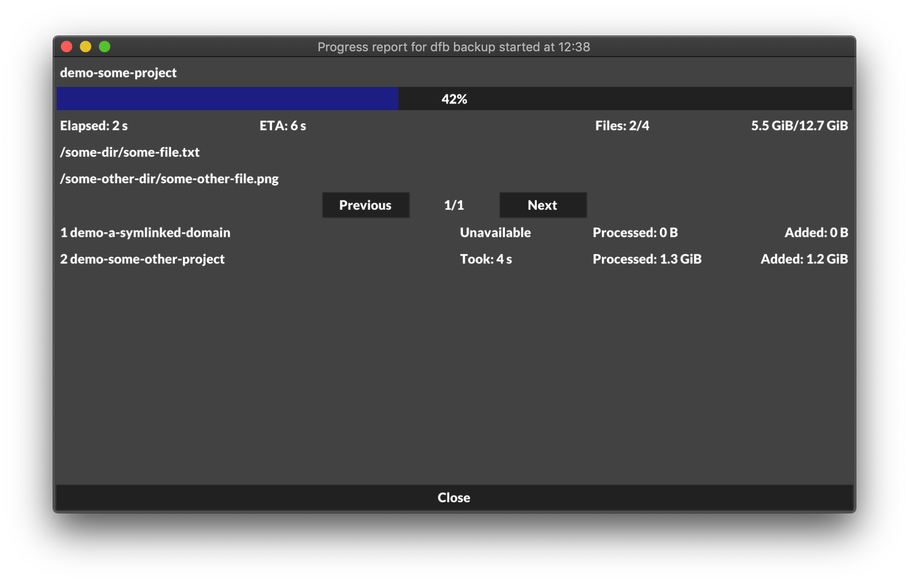
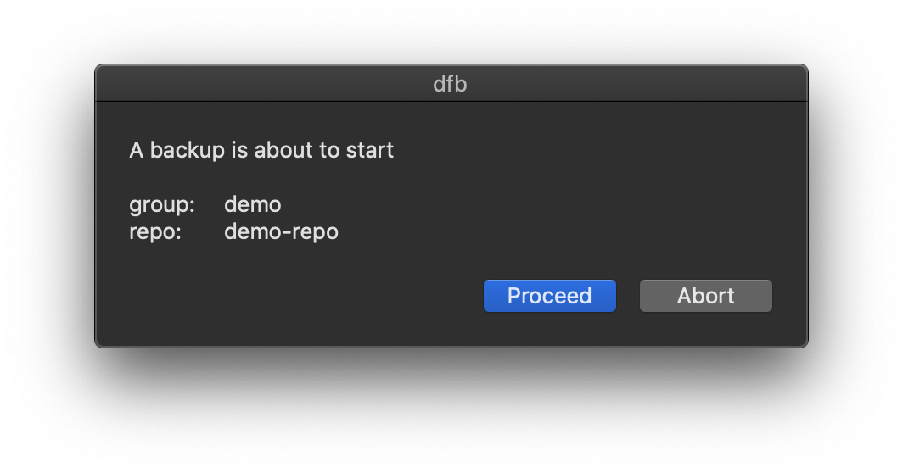
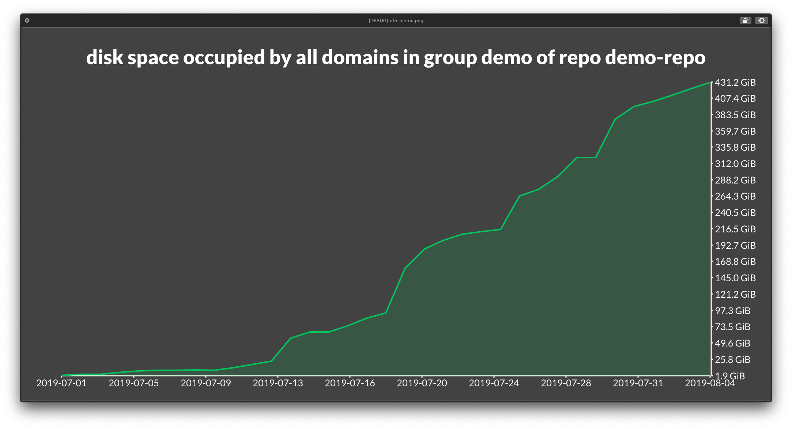

# Domain based Filesystem Backup

A backup approach and tool built on top of [restic](https://github.com/restic/restic) for macOS.

## About

Domain based Filesystem Backup (dfb) is backup of files organized by domains. A domain is arbitrary, but should be as narrow as possible but not to narrow. A single project such as a source code repository, documents for a project, or something longerlived such as a `.photoslibrary`.

Domains also include special directories such as `~/Library` and files in home directory such as `~/.zshrc` and `~/.gitconfig`.

The purpose of dfb is to allow for easier management of backups, better tools for monitoring backups that run in the background, easier recovery of backed up files, and easier retrival of useful stats about repos than a standalone restic installation provides.

## Installation

### Build and install locally

#### Install [restic](https://github.com/restic/restic)

```bash
brew install restic
```

#### Install FUSE for macOS

Either from [official website (recommended)](https://github.com/osxfuse/osxfuse) or using homebrew

```bash
brew update
brew tap homebrew/cask
brew cask install osxfuse
```

#### Install dependencies

```bash
brew install grep
brew install jq
brew install coreutils
brew install terminal-notifier
brew install expect
```

#### Install go and fyne

```bash
brew install go
go get fyne.io/fyne/cmd/fyne
```

#### Download and build dfb

```bash
git clone https://github.com/nattvara/dfb.git
cd dfb

./build.sh
```

#### Run the installer

```bash
./install.sh

dfb --version
# 1.1
```

## Usage

### Structuring the filesystem

The purpose of dfb is to keep domains separate and allow for backup, recovery and deletion of backups easy and isolated. Hence the filesystem must be organized in such a way.

```console
~
├── some-project
├── someorg-some-project -> /Volumes/some_disk/someorg-some-project
├── someorg-some-other-project
├── Desktop     # directory that shouldn't be backed up
├── Downloads   # directory that shouldn't be backed up
├── Library     # directory that should be backed up, but not renamed
└── ...
```

### Repositories

Repositories are created with restic.

```bash
restic -r [RESTIC REPO] init
```

[See the restic docs.](https://restic.readthedocs.io/)

### Groups

Domains should be organized by groups. A group contians a number of domains, and restic repositories to backup those domains to.

Creating groups is done with the `groups` command.

```console
$ dfb groups add
# Enter name of new group: demo
```

Groups can have one or more repos to back up to.

```console
$ dfb groups add-repo demo
# Enter name of repo: demo-repo
# Enter repo path: [RESTIC REPO]
```

### Domains

Adding domains to a group for backup is done with the `domains` command.

```bash
dfb domains add demo ~/demo-some-project
dfb domains add demo ~/demo-some-other-project
```

#### Symlinked domains

Domains can have their real source at another location than the `$HOME` directory. An example of this would be storing a domain on an external drive.

```bash
dfb domains add demo ~/demo-a-symlinked-domain /Volumes/[SOME VOLUME]/demo-a-symlinked-domain
```

In the background dfb:s filesystem agent will detect when the volume is availible and create a symkink to the real directory in the users `$HOME` directory.

### Backup

Backups are done with the `backup` commands.

Backup will launch a macOS dialogue to enter the password and subsequently take a snapshot of all domains that are availible (see [symlinked domains](#symlinked-domains)).

```console
$ dfb backup demo demo-repo
  backing up demo-a-symlinked-domain              100% ⏱  2.3s 💾 309.1 MiB 📊 gathering stats... done.
  backing up demo-some-other-project              100% ⏱  0.7s 💾 99.3 MiB 📊 gathering stats... done.
  backing up demo-some-project                    100% ⏱  0.3s 💾 0 B 📊 gathering stats... done.


  gathering stats for repo demo-repo... done
```

#### `--gui`

With the `---gui` flag progress will be displayed in a gui window. This is useful if the backup is started from a cron job or something similar.



#### `--confirm`

With the `--confirm` flag a dialogue will promt the user for action before backup starts. Also helpful if the backup is started by a cron job.



### Recovering files

The `recover` command will run the `restic mount` command and mount a read-only filesystem with provided repo. In the background dfb will create aliases to a domains backups under the path `path/to/domain/__recover__` like the following.

```console
demo-some-project
├── __recover__ -> ~/.dfb/demo/mountpoint/tags/demo-some-project
│   ├── 2019-01-04T10:00:41+02:00
│   │   └── some-file.txt
│   ├── 2019-03-04T12:43:31+02:00
│   │   └── some-file.txt
│   ├── 2019-04-04T10:30:02+02:00
│   │   └── some-file.txt
│   ├── 2019-05-04T02:12:39+02:00
│   │   └── some-file.txt
│   ├── 2019-07-04T07:12:30+02:00
│   │   ├── some-file.txt
│   │   └── some-other-file.txt
│   ├── 2019-07-04T01:10:31+02:00
│   │   ├── some-file.txt
│   │   └── some-other-file.txt
│   ├── 2019-08-04T17:21:59+02:00
│   │   ├── some-file.txt
│   │   └── some-other-file.txt
│   └── latest -> 2019-08-04T17:21:59+02:00  [recursive, not followed]
├── some-file.txt
└── some-other-file.txt
14 directories, 13 files
```

### Stats

The `stats` command offers a few helpful metrics to gain insight into how much space your backups occupy, which domains take up the most space or if time taken for backup is increasing/decreasing.

The following can be useful if restic repositories are stored in an environment where space is not free, on AWS S3 for instance.

```bash
dfb stats demo demo-repo repo-disk-space --time-unit days --time-length 34
```



#### Full list of options for the stats command

```console
Usage:
  stats [group] [repo] [metric] [flags]

Flags:
  -a, --aggregator string   aggregation method to use for a metric
  -d, --domain string       which domain to use for metric, not availiable for all metrics, optional/required for some metrics
  -h, --help                help for stats
      --list-aggregators    list availiable aggregators
      --list-metrics        list availiable metrics
      --list-time-units     list availiable time units
  -o, --output string       output path for png image of metric (default "/tmp/dfb-metric.png")
  -l, --time-length int     how many time-units of history should be included (default 7)
  -u, --time-unit string    time unit to use for metric (default "days")
```

### All availible commands

```console
_________/\\\__________/\\\\\___/\\\________
 ________\/\\\________/\\\///___\/\\\________
  ________\/\\\_______/\\\_______\/\\\________
   ________\/\\\____/\\\\\\\\\____\/\\\________
    ___/\\\\\\\\\___\////\\\//_____\/\\\\\\\\\__
     __/\\\////\\\______\/\\\_______\/\\\////\\\_
      _\/\\\__\/\\\______\/\\\_______\/\\\__\/\\\_
       _\//\\\\\\\\\______\/\\\_______\/\\\\\\\\\\_
        __\/////////_______\///________\//////////__

Domain based Filesystem Backup.

Usage:
  dfb <command> <subcommand> [parameters]

Available Commands:
  groups      Group commands.
  domain      Domain commands.
  backup      Backup a group of domains to a repo.
  recover     Mount backed up versions of domains for recovery.
  fsd         Control the filesystem agent.
  stats       Make a chart for a backup metric.

Options:
  -h --help     Show this screen.
  -v --version  Print version information.
```

## License

__MIT License__, see [LICENSE file](LICENSE).
